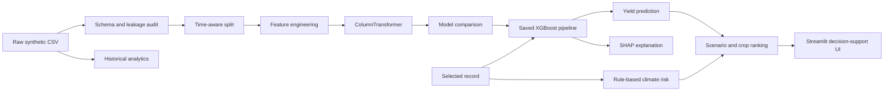

# AgriShield AI

**Explainable Machine Learning Framework for Agricultural Yield Prediction and Climate Risk Analytics**

> Data for Fields. Decisions for Tomorrow.

AgriShield AI is a Streamlit decision-support prototype for Maharashtra agriculture. It predicts crop yield, scores climate stress, explains individual predictions, runs model-based what-if scenarios, normalizes crop recommendations, and compares districts and historical trends.

The supplied 10,000-row dataset is synthetic. Results demonstrate an end-to-end ML framework; they are not verified farm measurements or operational agronomic advice.

## What the application includes

- Time-aware crop-yield regression with Ridge, Random Forest, Gradient Boosting, and XGBoost.
- Drought, heat, flood, and overall climate-risk scores from 0 to 100, clearly labeled as rules rather than ML predictions.
- Global permutation importance and local SHAP explanations on the transformed feature space.
- A what-if simulator for temperature, rainfall, soil moisture, and irrigation.
- Crop ranking based on crop-relative predicted performance and climate resilience.
- District comparison, historical Plotly charts, and condition-based advisory text.
- A polished multipage interface and a ready-to-use Pune/Soybean demo flow.

## Architecture



The trained artifact is one scikit-learn `Pipeline`: deterministic feature engineering → imputation/scaling/one-hot encoding → estimator. The preprocessing-only pipeline is also saved for inspection.

## Dataset audit

| Item | Finding |
|---|---|
| Shape | 10,000 rows × 34 columns |
| Time span | 2001–2025 |
| Coverage | 35 districts, 6 crops, 3 seasons, 5 agro-climatic regions |
| Missing values | 0 |
| Duplicate rows / IDs | 0 / 0 |
| Target | `yield_tonnes_per_ha` |
| Yield distribution | Mean 5.610, median 0.692, range 0.08–78.93 t/ha |
| Risk imbalance | Overall labels: 9,153 Low, 847 Medium, 0 High |

Yield is strongly crop-dependent: mean synthetic sugarcane yield is 33.89 t/ha, while cotton is 0.204 t/ha. This makes ungrouped correlations easy to misread. The 0.08 t/ha target floor and the long-tailed cultivated-area distribution are synthetic-data quality flags. `cultivated_area_ha` reaches 216,521 ha, which is more consistent with an aggregate district record than an individual farm.

### Leakage decisions

`production_tonnes` is excluded. It is the rounded post-harvest identity `yield_tonnes_per_ha × cultivated_area_ha`, so using it would reveal the target. The four supplied risk scores and four risk labels are also excluded from yield prediction: they are derived analytics and remain available only for historical dashboards. `record_id` and constant `state` add no predictive meaning and are excluded.

Inputs retained are year, district, agro-climatic region, crop, season, climate measurements, soil measurements, N/P/K, irrigation, extreme-weather counts, and cultivated area. These can plausibly be known or estimated before harvest in this prototype.

## Feature engineering

All transformations occur inside the model pipeline after the split.

| Feature | Rationale |
|---|---|
| Rainfall requirement ratio | Compares annual rainfall with a transparent crop-specific reference requirement. |
| Rainfall deficit index | Converts negative rainfall anomaly into bounded moisture stress. |
| Heat stress index | Combines crop-specific maximum-temperature exceedance and hot-day exposure. |
| Drought stress index | Combines deficit, dry spells, soil moisture, and irrigation coverage. |
| Soil fertility index | Summarizes bounded N/P/K levels with a soil-pH suitability component. |
| Irrigation adequacy | Compares irrigation coverage with a crop-specific reference need. |
| Extreme-weather days | Combines hot, dry, and heavy-rain-day exposure. |
| Rainfall × soil interaction | Represents the fact that rainfall response depends on stored soil moisture. |
| Temperature × rainfall interaction | Captures simultaneous anomaly direction without claiming causality. |
| Growing-condition score | A bounded composite of water balance, moisture, fertility, irrigation, and heat stress. |

These are transparent model inputs, not validated agronomic indices. Production and risk outputs are never used to engineer yield features.

## Evaluation design

- Training: 2001–2020, 8,010 records.
- Validation and model selection: 2021–2022, 795 records.
- Final untouched test: 2023–2025, 1,195 records.
- Diagnostic random split: stratified by crop, reported only for comparison.

This is more realistic than relying only on a random split because a future-yield system must generalize from older observations to newer seasons. The random split mixes years and can conceal temporal drift.

### Model results

| Model | Test MAE | Test RMSE | Test R² | Test MAPE* |
|---|---:|---:|---:|---:|
| XGBoost | **0.551** | **1.564** | **0.987** | 15.97% |
| Random Forest | 0.579 | 1.739 | 0.984 | **10.67%** |
| Gradient Boosting | 0.726 | 2.206 | 0.975 | 23.40% |
| Ridge | 2.611 | 4.951 | 0.874 | 287.21% |

XGBoost was selected by the 2021–2022 validation RMSE and confirmed as the best RMSE model on the untouched 2023–2025 test. Random Forest's lower MAPE is reported because metrics emphasize different errors. No accuracy claim should be generalized beyond this synthetic dataset.

\*MAPE excludes targets below 0.10 t/ha; percentage errors are unstable near zero. MAE and RMSE are the primary scale-aware metrics.

## Climate-risk method

The scenario engine produces separate transparent indices:

- Drought: rainfall deficit, consecutive dry days, low soil moisture, low irrigation, and crop-relative rainfall.
- Heat: crop-specific heat exceedance, hot days, positive temperature anomaly, and moisture stress.
- Flood: positive rainfall anomaly, heavy-rain days, excessive crop-relative rainfall, and saturated soil.
- Overall: `42% drought + 33% heat + 25% flood`.

Scores are clipped to 0–100. Categories are Low (0–33), Medium (34–66), and High (67–100). Historical pages can show the dataset's supplied risk scores. Scenario pages use the independent rule engine so changed inputs can be recalculated. Neither is described as an ML forecast or a disaster probability.

## Explainability

Global importance uses permutation importance on recent held-out records. Local explanations transform the selected row and background sample through the same fitted feature and preprocessing steps, then run SHAP against the final estimator. This avoids attaching made-up explanations to raw fields the estimator never saw. If SHAP is unavailable at runtime, a clearly limited signed contribution fallback keeps the page usable.

## What-if simulator

The simulator changes temperature (−3 to +5 °C), rainfall (−50% to +50%), soil moisture, and irrigation. It then recalculates modeled yield and transparent climate risk. Secondary weather counts change through documented deterministic sensitivity rules. This is a model sensitivity experiment, not a causal or downscaled climate projection.

## Crop suitability formula

For every crop, the app predicts yield under the same selected environmental conditions and converts that yield to a percentile within that crop's historical synthetic distribution:

`Suitability = 0.72 × crop-relative yield percentile + 0.28 × (100 − overall climate risk)`

The percentile prevents naturally high-tonnage crops from winning solely because their units are larger.

## Project structure

```text
AgriShield-AI/
├── app.py
├── requirements.txt
├── README.md
├── DEMO_AND_VIVA.md
├── assets/styles.css
├── data/
│   ├── raw/maharashtra_agri_yield_climate_risk_10000.csv
│   └── processed/agriculture_prepared.csv
├── models/
│   ├── yield_model.joblib
│   ├── preprocessing.joblib
│   └── model_metadata.json
├── notebooks/
│   ├── 01_eda.ipynb
│   ├── 02_feature_engineering.ipynb
│   └── 03_model_training.ipynb
├── pages/                         # 10 Streamlit pages
├── reports/                       # EDA, trends, district, crop, model results
├── src/                           # reusable analysis and app modules
└── tests/test_core.py
```

## Installation and VS Code run instructions

1. Install Python 3.12, then open the `AgriShield-AI` folder in VS Code.
2. Open **Terminal → New Terminal**.
3. Create and activate a virtual environment.

PowerShell:

```powershell
py -m venv .venv
.\.venv\Scripts\Activate.ps1
python -m pip install --upgrade pip
pip install -r requirements.txt
streamlit run app.py
```

Command Prompt:

```bat
py -m venv .venv
.venv\Scripts\activate.bat
python -m pip install --upgrade pip
pip install -r requirements.txt
streamlit run app.py
```

Open the local URL printed by Streamlit, normally `http://localhost:8501`. The trained model and processed data are already included. To reproduce EDA and retrain:

```powershell
python -m src.train
python -m unittest discover -s tests -v
```

## Presentation screenshots

Add exported screenshots here before publishing the repository:

1. Dashboard with four KPI cards and Pune/Soybean demo.
2. What-if comparison showing +2 °C and −20% rainfall.
3. Local SHAP contribution chart.
4. Crop recommendation ranking.
5. District comparison view.

## Limitations

- Synthetic observations must not be interpreted as official Maharashtra farm measurements.
- The high test R² reflects the synthetic generator and should not be treated as real-world accuracy.
- Scenario simulation demonstrates learned sensitivity, not causal climate forecasting.
- Crop requirement thresholds and risk weights are transparent prototype assumptions, not locally validated agronomy.
- Random row-level observations may represent aggregates; spatial and farm identities are unavailable.
- No verified district GeoJSON was supplied, so the app deliberately uses a comparison visualization instead of fabricated boundaries.
- Real operations require uncertainty intervals, external validation, drift monitoring, governance, and agronomist review.

## Future improvements

- Validate rainfall and temperature with official IMD station/gridded products and robust station-to-district mapping.
- Join official crop area, production, and yield statistics from government open-data sources with consistent crop-year definitions.
- Add soil-test observations and Soil Health Card variables with sampling dates and laboratory quality flags.
- Add Sentinel-2/Landsat vegetation, moisture, and crop-phenology features; validate cloud masking and temporal alignment.
- Add irrigation source, sowing window, cultivar, pest/disease, and management-practice data.
- Use spatial cross-validation, probabilistic prediction intervals, calibrated alerts, fairness/error analysis by district and crop, and temporal drift monitoring.
- Add a validated district boundary GeoJSON and document name/code joins before enabling a choropleth.

See `DEMO_AND_VIVA.md` for the three-minute presentation and likely professor questions.
